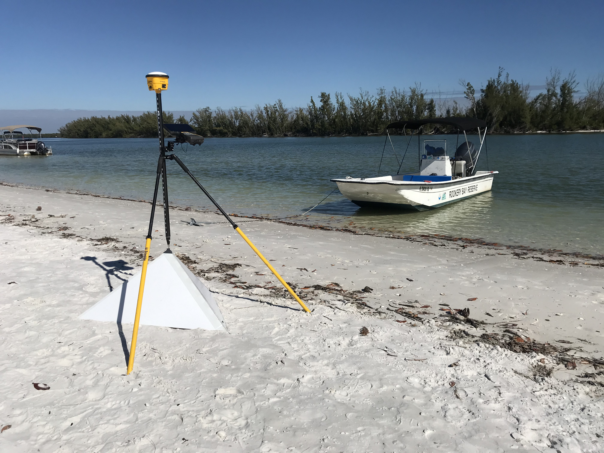
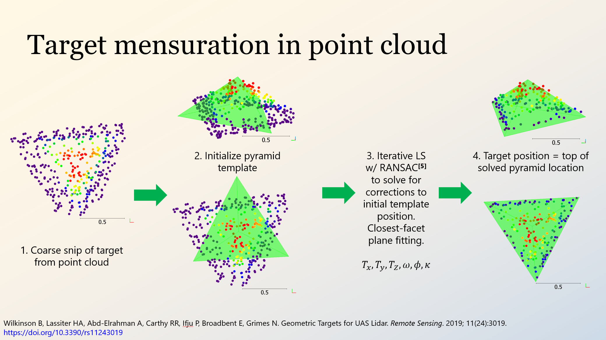
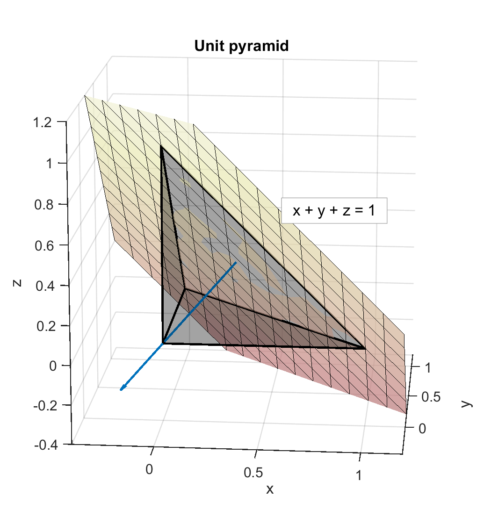
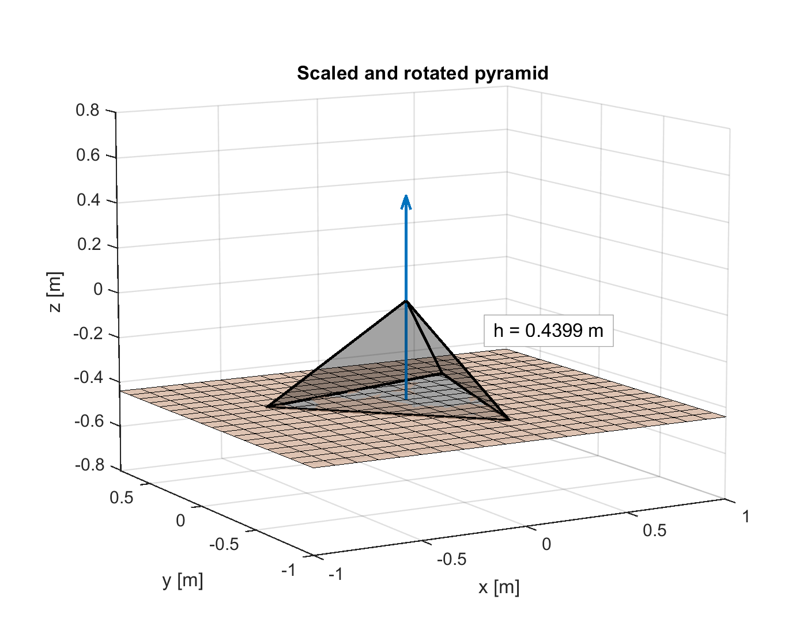

# Solving for the geometry of a corner cube pyramid

This MATLAB script analyzes the geometry of the corner cube pyramid target created by the Geospatial Mapping and Applications Laboratory (GMAP) at the University of Florida.

## Purpose of the pyramids

In 2019, GMAP and the [UF UAS Research Program](https://uas.ifas.ufl.edu/) developed a pyramidal target for UAS lidar research. The pyramids can be identified and their positions accurately mensurated within a UAS lidar point cloud, and their "real world" locations can be surveyed via total station, GNSS, and leveling to accurately determine their positions in the scene. Comparisons between the mensurated and surveyed locations provide the basis for accuracy assessments, calibrations, and adjustments of the UAS lidar data.

More on the development and testing of the pyramids can be found in [Geometric Targets for UAS Lidar (Wilkinson *et al.*, 2019)](https://doi.org/10.3390/rs11243019).

## Purpose of this script

Mensurating the pyramids in point cloud data requires a template of the pyramid to use for regression fitting. Thus the geometry of the pyramid needs to be known as exactly as possible for constructing this template. The script solves for the geometry of the pyramid analytically and plots the results for visual confirmation. 

## Steps for proving the geometry of the pyramid

### Definition and orientation of corner cube w/r/t unit cube

The script begins with a simple definition of a corner cube pyramid with the apex at the origin $(0,0,0)$ and the vertices of the equilateral triangle base at $(1,0,0)$, $(0,1,0)$, and $(0,0,1)$. I call this the "unit pyramid."

It can be easily shown that the base is coincident with the plane $x+y+z=1$ with normal $\mathbf{n_b}=\langle \frac{\sqrt{3}}{3},\frac{\sqrt{3}}{3},\frac{\sqrt{3}}{3} \rangle$.

### Center of the base

The center of the base is the intersection of its medians. The two points of a median along the base of the unit pyramid will be 

1) a vertex and
2) the midpoint between the remaining two vertices.

A line in vector form is defined as $\mathbf{p}=\mathbf{p_0}+t\mathbf{v_p}$ where direction $\mathbf{v_p}$ can be found from two points: $\mathbf{v_p=p_0-p_1}$.

Assuming that two lines $\mathbf{p}$ and $\mathbf{q}$ must necessarily intersect, the condition $\mathbf{p=q}$ is true. Thus the intersection can be found as such:

$\mathbf{p_0}+t\mathbf{v_p}=\mathbf{q_0}+u\mathbf{v_q}$

This is rearranged to solve by least squares $Ax=b$ where $A=[\mathbf{v_p \ \ -v_q}]$ (a $3\times 2$ matrix) and $b=[\mathbf{q_0-p_0}]$ (a $3\times 1$ vector), and solving for $x=[t \ \ u]^T$. Solving for either of $\mathbf{p}(t)$ or $\mathbf{q}(u)$ yields the center of the base.

### Height of the pyramid

It is trivial to show the projection of the apex of the pyramid onto its base along the normal of the base $\mathbf{n_b}$ is coincident with the center of the base. Thus the height of the pyramid is the distance between the apex and the center of the base. For the unit pyramid, with its apex at the origin, the height of the pyramid is the length of vector $\mathbf{p}(t)$.

### Scale to constructed dimensions and rotate to up

The mensuration algorithm in Wilkinson *et al.* cited above begins with the pyramid template in an initial position facing apex up. The templte is a PLY file, which can define a shape from its vertices. To calculate the vertices of the pyramid, the unit pyramid needs to be scaled to match its real-world construction and rotated to point apex up.

This script rotates the unit pyramid to up $\mathbf{k}=\langle 0,0,1 \rangle$ via quaternion rotation. But first, the pyramid is scaled to its real-world dimensions. (The earlier solution for the height of the pyramid is scaled as well.) The pyramids as constructed are 30 in. (76.2 cm) along the legs of the right triangle faces. These legs are of unit length in the unit pyramid.

The quaternion representing the rotation between two vectors is defined as

$q=(\cos{\dfrac{\theta}{2}},\mathbf{n}\sin{\dfrac{\theta}{2}})$

where $\theta$ is the angle between the two vectors and $\mathbf{n}$ is the normal of the plane formed by the two vectors: $\theta=\mathbf{n_b \cdot k}$ and $\mathbf{n=n_b \times k}$.

The MATLAB quaternion rotation function `quatrotate()` is designed to rotate the space around a vector or object; to rotate an object, the inverse of quaternion $q$ as defined above is used.

The vertices of the rotated and scaled pyramid can be used to construct a template (such as a [PLY](https://en.wikipedia.org/wiki/PLY_(file_format))) that can be used for fitting to point cloud data.